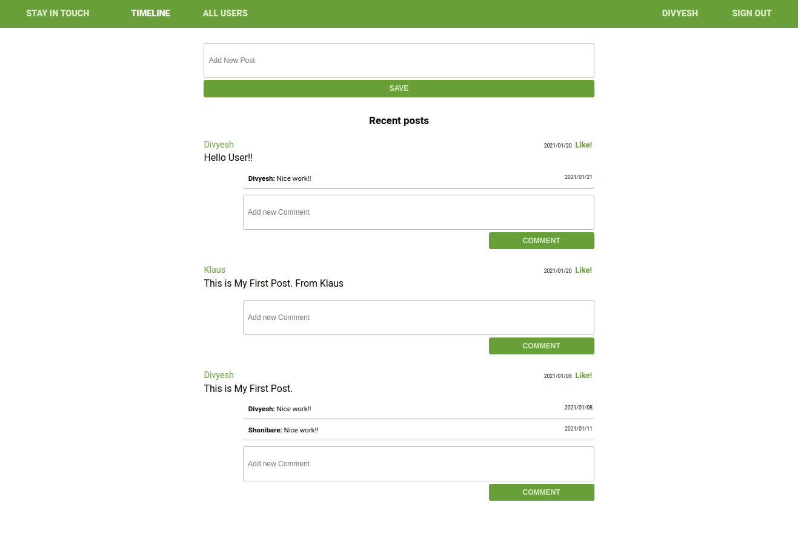

# Scaffold for social media app with Ruby on Rails



> This repo includes intial code for social media app with basic styling. Its purpose is to be a starting point for Microverse students.

## Built With

- Ruby v2.7.0
- Ruby on Rails v5.2.4

## Live Demo

Checkout the live demo at [Live](https://agile-sands-69934.herokuapp.com/)


## Getting Started

To get a local copy up and running follow these simple example steps.

### Prerequisites

Ruby: 2.6.3
Rails: 5.2.3
Postgres: >=9.5

### Setup

Instal gems with:

```
bundle install
```

Setup database with:

```
   rails db:create
   rails db:migrate
```

### Github Actions

To make sure the linters' checks using Github Actions work properly, you should follow the next steps:

1. On your recently forked repo, enable the GitHub Actions in the Actions tab.
2. Create the `feature/branch` and push.
3. Start working on your milestone as usual.
4. Open a PR from the `feature/branch` when your work is done.


### Usage

Start server with:

```
    rails server
```

Open `http://localhost:3000/` in your browser.

### Run tests

```
    rspec --order defined --format documentation
```
- Please Add `--order defined` flag if you runnig all the tests at once.
- you can also run test individually by specifying `file name`
e.g ` rspec spec/models/like_spec.rb ` 

> Tests will be added by Microverse students. There are no tests for initial features in order to make sure that students write all tests from scratch.

## Authors

👤 **Mian Faizan Ali Full Stack Programmer**

- GitHub: [@Faizanalifullstackprogrammer](https://github.com/Faizanalifullstackprogrammer)
- Twitter: [@mianfaizanali](https://twitter.com/mianfaizanali)
- LinkedIn: [Mianfaizanali](https://pk.linkedin.com/in/mianfaizanali)

👤 

## 🤝 Contributing

Contributions, issues and feature requests are welcome!

Feel free to check the [issues page](issues/).

## Show your support

Give a ⭐️ if you like this project!

## Acknowledgments

- [Ruby-doc](https://ruby-doc.org/core-2.6.5)
- [Rails-doc](https://guides.rubyonrails.org/)
